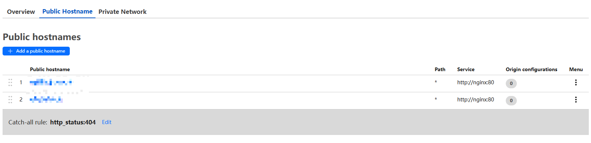
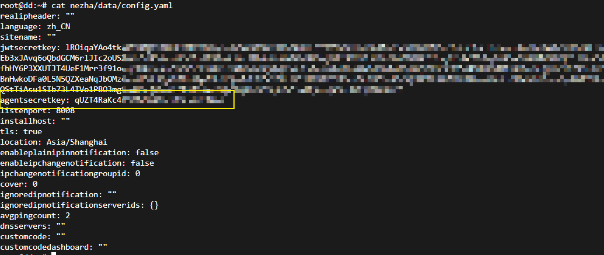

# 哪吒v1尝鲜共存版
仅供尝鲜，后续不维护，可以与v0共存。BUG多多，仅能正常安装。  
无需公网IP，全程都在CF下。
## 服务端
1. 安装好docker
1. 申请 CloudFlare Tunnel Token  
https://developers.cloudflare.com/cloudflare-one/connections/connect-networks/get-started/create-remote-tunnel/
2. CloudFlare开启GRPC流量代理  
https://developers.cloudflare.com/network/grpc-connections/
3. 服务端启动  
    ```shell
    git clone https://github.com/yumusb/nezha-new.git  
    ```
    编辑一下 conf.d/main.conf 中的两个域名，第一个用来心跳，第二个用来访问  
    编辑 .env 文件中的 TUNNEL_TOKEN 为自己申请的 
    ```shell
    docker compose up -d 
    ```
5. 服务端映射到CF  
    CloudFlare Tunnel 加两个Public hostname 如下，都指向 http://nginx:80 
    
    不出意外，现在可以正常访问了到。
## AGENT
1. 查看密钥  
    在服务端data/config.yaml文件里面的`agentsecretkey`字段
    
2. 脚本安装
    ```shell
    wget https://raw.githubusercontent.com/yumusb/nezha-new/refs/heads/main/installagent.sh
    chmod +x ./installagent.sh
    ./installagent.sh 密钥 心跳域名:443 true
    ```
    或者使用域名（国内连不上github）
    ```shell
    wget https://n.xingx.ing/installagent.sh;chmod +x ./installagent.sh;./installagent.sh 密钥 心跳域名:443 true
    ```

## 其他  
后台地址 /dashboard  
默认密码 admin/admin